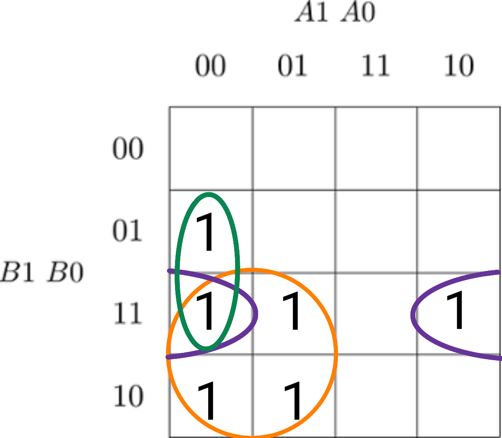
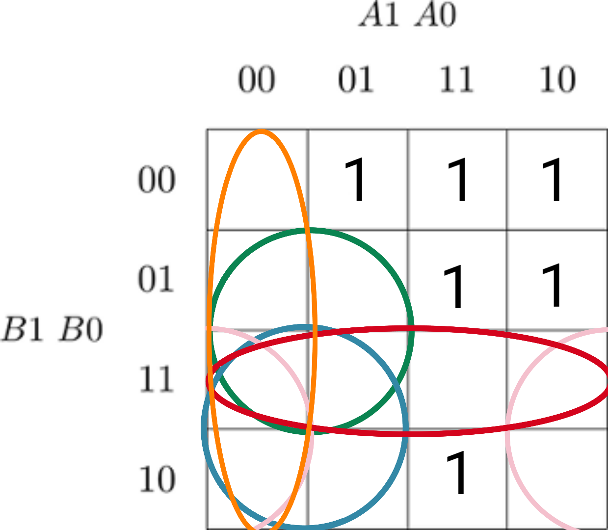
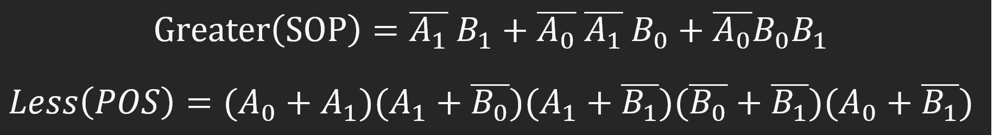

# Lab 2: Michal Vida

### 2-bit comparator

1. Karnaugh maps for other two functions:

   Greater than:

   

   Less than:

   

2. Equations of simplified SoP (Sum of the Products) form of the "greater than" function and simplified PoS (Product of the Sums) form of the "less than" function.

   

### 4-bit comparator

1. Listing of VHDL stimulus process from testbench file (`testbench.vhd`) with at least one assert (use BCD codes of your student ID digits as input combinations). Always use syntax highlighting, meaningful comments, and follow VHDL guidelines:

   Last two digits of my student ID: 07

```vhdl
  p_stimulus : process
  begin    

      report "Stimulus process started" severity note;

      --Will report error
      signal_A <= "0000";
      signal_B <= "0111";
      wait for 100 ns;

      assert ((signal_A_greater_B = '0') and
              (signal_A_equal_B  = '1') and
              (signal_A_less_B    = '0'))

      report "Input combination 0000, 0111 FAILED" severity error;

      report "Stimulus process finished" severity note;

      wait;

  end process p_stimulus;
```

2. Text console screenshot during your simulation, including reports.

   

3. Link to your public EDA Playground example:

   [4-Bit comparator](https://www.edaplayground.com/x/BBzB)
