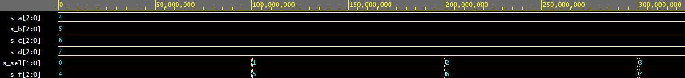

# Lab 3: Michal Vida

### Three-bit wide 4-to-1 multiplexer

1. Listing of VHDL architecture from source file `mux_3bit_4to1.vhd`. Always use syntax highlighting, meaningful comments, and follow VHDL guidelines:

```vhdl
architecture Behavioral of mux_3bit_4to1 is
begin

with sel_i select
f_o <= a_i when "00",
       b_i when "01",
       c_i when "10",
       d_i when others;

end architecture Behavioral;
```

2. Screenshot with simulated time waveforms. Always display all inputs and outputs (display the inputs at the top of the image, the outputs below them) at the appropriate time scale!

   

3. Listing of pin assignments for the Nexys A7 board in `nexys-a7-50t.xdc`. **DO NOT list** the whole file, just your switch and LED settings.

```shell
##Switches
set_property -dict { PACKAGE_PIN J15   IOSTANDARD LVCMOS33 } [get_ports { sel_i[1]}]; #IO_L24N_T3_RS0_15 Sch=sw[0]
set_property -dict { PACKAGE_PIN L16   IOSTANDARD LVCMOS33 } [get_ports { sel_i[0]}]; #IO_L3N_T0_DQS_EMCCLK_14 Sch=sw[1]
...

## LEDs
set_property -dict { PACKAGE_PIN V14   IOSTANDARD LVCMOS33 } [get_ports { f_o[2] }]; #IO_L22N_T3_A04_D20_14 Sch=led[13]
set_property -dict { PACKAGE_PIN V12   IOSTANDARD LVCMOS33 } [get_ports { f_o[1] }]; #IO_L20N_T3_A07_D23_14 Sch=led[14]
set_property -dict { PACKAGE_PIN V11   IOSTANDARD LVCMOS33 } [get_ports { f_o[0] }]; #IO_L21N_T3_DQS_A06_D22_14 Sch=led[15]
...
```
